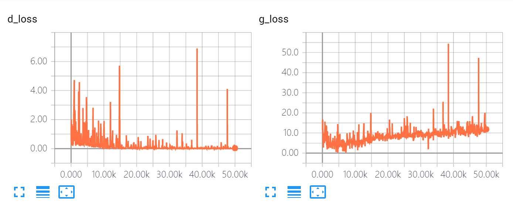
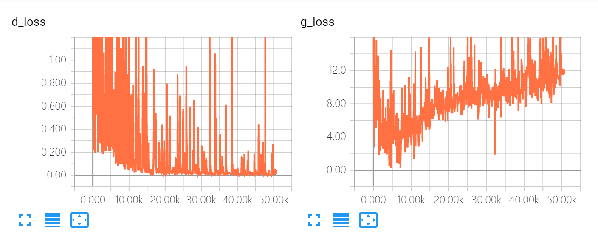
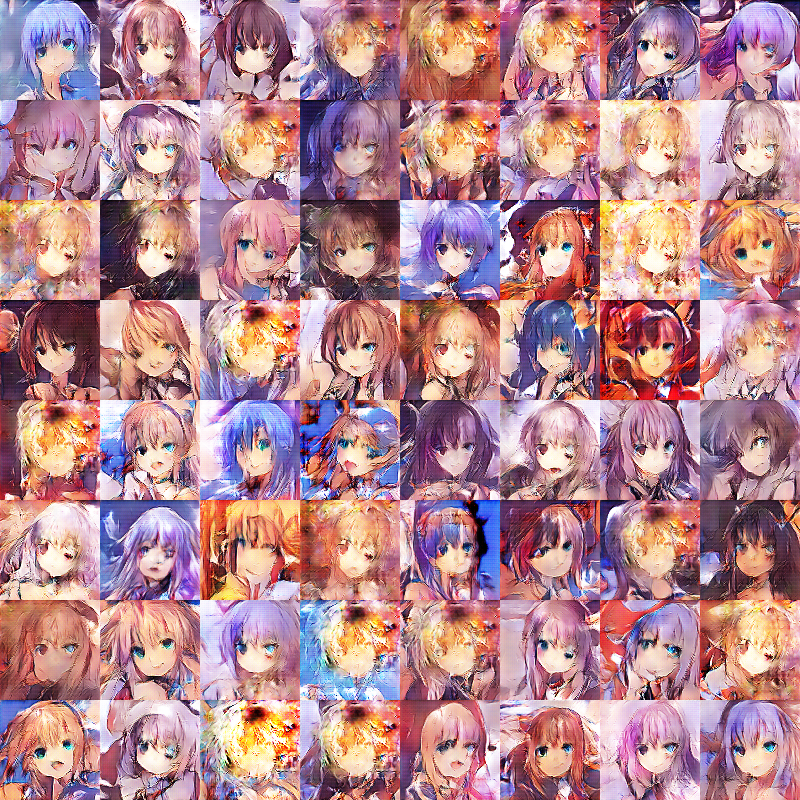

### run 1
the default hyper paramters values from the paper

- learning rate = 0.0002 and beta1 = 0.5 for D and G
- same NN architecture as paper except that filter size is smaller
- no dropout applied (disabled)
- batch_size = 128

still running

### run 2
- changes learning rate = 0.0005 for D

<table>
<tr><td>10k</td><td>20k</td><td>30k</td><td>40k</td><td>50k</td></tr><tr><td>

</td><td>

</td><td>

</td><td>

</td><td>

</td></tr>
</table>

d_loss increases rapidly after 15k steps for several times, causing mode collapse for G.

The quality for generator is not good enough.